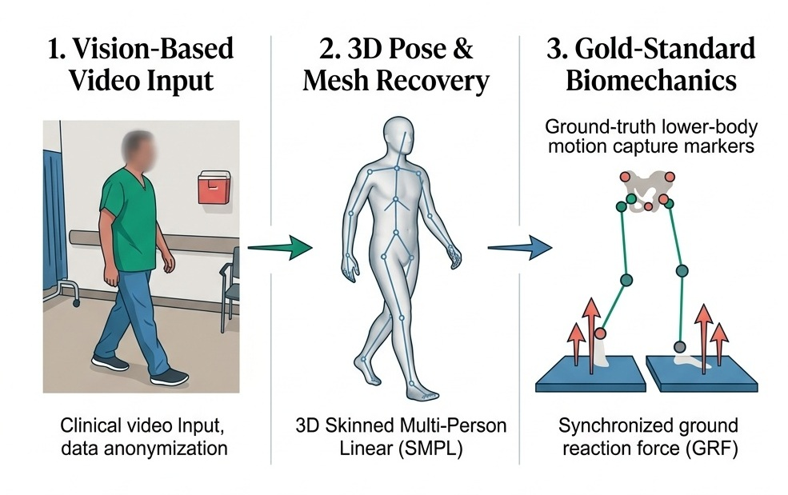
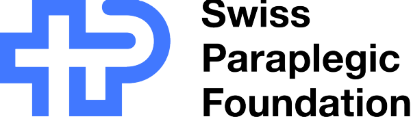

# SCAI-SCI Gait Dataset

<div align="center">

### Multi-Modal Clinical Benchmark of Walking in Spinal Cord Injury: Optical Motion Capture, Ground Reaction Forces, Surface EMG, and Video-Derived SMPL 3D Body Models

<!-- Publications & Data Access -->
[](https://arxiv.org/abs/2610.05552)
[](https://doi.org/10.1038/s41746-025-02211-y)
[](https://physionet.org/content/scai-sci-gait-dataset)

<br/>

<!-- Standards, Environment & Licensing -->
[](metadata/README.md)
[](requirements.txt)
[](LICENSE.txt)
[](#citation)

</div>

---

> [!IMPORTANT]
> **The data are not hosted in this repository.** The optical motion capture trials, SMPL body model sequences,
> 3D renders, and clinical metadata contain sensitive patient information. They are distributed through
> **[PhysioNet](https://physionet.org/content/scai-sci-gait-dataset)** as credentialed-access data, under a Data Use Agreement
> that strictly prohibits any attempt to identify or re-identify a participant.
>
> This repository provides the official documentation, complete data dictionary, interactive 3D viewers, data loading
> examples, and the processing pipeline that produced the SMPL sequences.

---

## Overview

Instrumented 3D gait analysis is the clinical gold standard for assessing walking after spinal cord
injury (SCI). However, it requires a specialized motion-capture laboratory that few clinical centers possess. Markerless video
methods could bring accessible gait assessment to broader clinical and home settings, but they are rarely validated on
neurological gait.

<p align="center">
  
</p>

*Schematic illustration of the dataset (not participant data): sagittal walking video
reconstructed as a 3D SMPL body model, with laboratory motion capture and force plates as
the reference.*

The **SCAI-SCI Gait Dataset** bridges this gap by pairing both modalities in a comprehensive clinical release. It covers **240 adults with traumatic or
non-traumatic SCI**, assessed in the specialized gait laboratory of the Swiss Paraplegic Centre (Nottwil, Switzerland)
during routine clinical care. For each participant, it provides synchronized optoelectronic motion capture with ground reaction forces from two
force plates (and surface EMG in 194 trials), 3D SMPL body models reconstructed with CameraHMR from sagittal-plane video
of the same session, and a clinical table standardized to the International SCI Core Data Set v3.0.

<div align="center">

| | Count |
|:---|---:|
| Participants | **240** |
| Motion-capture trials (`.c3d`) | **300** (180 participants with 1 trial, 60 with 2) |
| Marker frames | 222,400 (23 min of walking) |
| Trials with surface EMG | 194 (171 participants) |
| SMPL sequences (`.pkl`) | **300** (239 participants) |
| SMPL mesh frames | 44,980 (at 15 fps) |
| SMPL renders (`.mp4`) | 299 |
| Clinical table | 240 rows × 14 columns |
| Per-trial gait parameters | 300 trials (292 with a full gait cycle) |

</div>

---

## Contents

1. [Overview](#overview)
2. [What the release contains](#what-the-release-contains)
3. [Cohort](#cohort)
4. [Ethics and de-identification](#ethics-and-de-identification)
5. [Why CameraHMR](#why-camerahmr)
6. [This repository](#this-repository)
7. [Installation](#installation)
8. [Getting the data](#getting-the-data)
9. [Viewers](#viewers)
10. [Loading the data](#loading-the-data)
11. [Known limitations](#known-limitations)
12. [Citation](#citation)
13. [License](#license)
14. [Acknowledgements](#acknowledgements)
15. [Funding](#funding)
16. [Authors and contributions](#authors-and-contributions)
17. [Contact](#contact)

---

## What the release contains

```text
RELEASE_v1.5_SCAI-SCI-Gait/                                            4.3 GB
├── MoCap_Data/      300 .c3d  mocap<studyID>-<trial>.c3d                     209 MB
├── SMPL_Data/       300 .pkl  v<studyID>_sagittal_<li|re>_defaced_smpl_sequence.pkl   3.5 GB
├── SMPL_Videos/     299 .mp4  v<studyID>_sagittal_<li|re>_defaced.mp4        571 MB
├── metadata/
│   ├── medical_metadata.csv   clinical table, 240 × 14
│   ├── data_dictionary.csv    every column of every table and every file field (94 rows)
│   └── cohort_counts_*.csv    6 attributes released only as counts
├── trials.csv       one row per released file (899 rows)
├── gait_parameters.csv  one row per MoCap trial (300 rows)
└── manifest.sha256  SHA-256 of every file (909 entries)
```

All modalities link via **`studyID`**, which forms the prefix of every file name. It is a pseudorandomized number drawn
for this release (1–240); it does not correspond to hospital record numbers, nor does it match any other release.

| Part | Content | Details |
|:---|:---|:---|
| **MoCap** | 20 lower-body markers (IOR protocol) in mm, at 100, 200 or 246 Hz. Two Bertec force plates (6 channels each, C3D type 4). Raw surface EMG in 194 trials. | [`MoCap_Data/`](MoCap_Data/README.md) |
| **SMPL sequences** | CameraHMR fits of the SMPL body model to each frame of the sagittal video: pose, shape, 24 joint positions and the 6,890-vertex mesh, 46–553 frames per sequence. | [`SMPL_Data/`](SMPL_Data/README.md) |
| **SMPL renders** | Each sequence rendered as a grey mesh on a black background (H.264, 15 fps). No camera image. | [`SMPL_Videos/`](SMPL_Videos/README.md) |
| **Clinical table** | Sex, age group, neurologic category, level region, completeness, etiology, time since injury, LEMS, SCIM III mobility, walking condition, care setting, vibration sense, spasticity. | [`metadata/`](metadata/README.md) |
| **Index** | `trials.csv`: modality, frames, duration, rates, marker completeness, EMG muscles, force-plate channel map, analog units, SMPL frame range and walking direction. | [`metadata/data_dictionary.csv`](metadata/data_dictionary.csv) |
| **Gait parameters** | `gait_parameters.csv`: strides, walking speed, cadence, stride and step length, step width, stance, swing, double support and stride-time variability, per trial. | [`MoCap_Data/`](MoCap_Data/README.md#gait-parameters) |

The data dictionary in this repository is the one shipped with the release. It is the
reference for every column and file field.

---

## Cohort

Counts of the 240 participants from the clinical table. Counts below 5 are shown as <5.

| Variable | Participants |
|:---|:---|
| Sex | male 179; female 61 |
| Age at examination (ISCoS groups) | 15–29: 41; 30–44: 61; 45–59: 87; 60–74: 46; 75+: 5 |
| Neurologic category | AIS D, any level: 213; T1–S5 AIS ABC: 18; AIS E (no deficit): 6; C1–4 AIS ABC: <5; not recorded: <5 |
| Region of the neurological level | C1–4: 33; C5–8: 64; T1–S5: 133; intact: 5; not recorded: 5 |
| Completeness (AIS) | incomplete (B–E): 229; complete (A): 9; not recorded: <5 |
| Etiology | traumatic: 171; non-traumatic: 67; not recorded: <5 |
| Years since injury | <1: 143; 1–4: 55; 5–9: 16; 10–14: 5; 15–19: 8; 20–24: <5; 25–29: 8; 30+: <5 |

Walking speed over the 292 trials with a full gait cycle: median 0.98 m/s (range
0.22–1.53 m/s).

---

## Ethics and de-identification

**Study design.** Data were collected during routine clinical practice and analyzed
retrospectively in accordance with the Swiss Human Research Act (HRA, Art. 32–33). The project "Gait in ambulatory
patients with spinal cord injury" was approved by the Ethikkommission Nordwest- und
Zentralschweiz (**EKNZ, BASEC 2022-00935**). Amendment 01 (study protocol v3.0), which
permits sharing the data under credentialed access, was approved on 29 July 2026. Since 2010, every patient of the
Swiss Paraplegic Centre has been informed regarding the potential research use of their routine clinical
data and provided the opportunity to decline. Only data from patients who did not decline were included.

**Participants.** Adults (18 years or older at examination) with traumatic or non-traumatic
SCI, capable of walking independently for at least 10 m with or without assistive aids, assessed in the
gait laboratory between 2010 and 2022. Six additional participants were excluded prior to
release under protocol criteria (5 under 18 years of age at examination, 1 without clinical data).

**De-identification** followed the SPHN Risk Assessment Template v2.1.2. It was carried
out and verified with the SCAI Lab release toolkit:

- **Identifiers.** Participants carry new pseudorandomized numbers drawn for the release. The key remains on
  the institution's secure data server. No name, birth date, hospital number, or calendar date appears
  in any released file.
- **C3D headers.** Only the `POINT`, `ANALOG`, `FORCE_PLATFORM`, and `EVENT` groups are
  retained, with free-text descriptions blanked. Every other group is removed, including the
  one where acquisition software stores patient fields, operator names, and timestamps.
  Marker trajectories and analog signals remain uncorrupted.
- **Clinical table.** Core Data Set variables are reported in standard clinical groups: age in ISCoS
  groups, time since injury in Core groups, and scores in bands. The neurological level,
  height, weight, subcategory, etiology codes, and time in rehabilitation are released only
  as aggregate cohort counts. No per-side level, individual muscle grade, or joint angle is released.
- **Video.** No raw camera video is released. SMPL is a parametric template mesh without
  texture or facial geometry, fitted to defaced video footage. The renders display only that mesh on
  a solid black background.
- **Verification.** Every file header was audited field by field. The released files were
  scanned against source identifiers to ensure zero leakage. A file-level re-identification red-team audit was
  performed, and the formal SPHN risk assessment was scored from the released content.

Because gait dynamics and body shape are biometric and clinical demographics are not k-anonymized, the dataset is accessible exclusively under credentialed access.

---

## Why CameraHMR

Five monocular SMPL-based human mesh recovery methods were benchmarked against motion
capture on this cohort: CameraHMR, WHAM, Multi-HMR, W-HMR, and PLIKS ([Natraj et al., 2026](https://arxiv.org/abs/2610.05552)). Scoring evaluated nine lower-body joints (pelvis, bilateral hips, knees, ankles, and
toes), with PA-MPJPE computed per valid frame.

| Method | High resolution | Low resolution | Overall (valid frames) |
|:---|---:|---:|---:|
| **CameraHMR** | 70.6 ± 15.2 mm | 97.9 ± 25.5 mm | **83.0 ± 24.6 mm (41,457)** |
| WHAM | 71.1 ± 13.8 mm | 99.6 ± 22.0 mm | 83.5 ± 22.7 mm (36,582) |
| W-HMR | 70.8 ± 10.9 mm | 99.3 ± 23.2 mm | 83.7 ± 22.6 mm (34,088) |
| PLIKS | 72.7 ± 14.2 mm | 130.2 ± 54.5 mm | 94.8 ± 45.1 mm (30,844) |
| Multi-HMR | 74.6 ± 11.9 mm | 112.2 ± 44.1 mm | 81.7 ± 26.1 mm (18,801) |

CameraHMR reconstructed the highest number of valid frames, with the second-lowest overall error, and
degraded least at lower video resolutions. Although Multi-HMR achieved lower error on clean frames, it reconstructed fewer
than half as many valid frames. Missing frames and joint errors both propagate into downstream
kinematic calculations, so CameraHMR was selected for the released sequences.

[`scripts/camerahmr_pipeline.py`](scripts/camerahmr_pipeline.py) assembles CameraHMR's
per-frame outputs into the sequence files.

---

## This repository

```text
SCAI-SCI-Gait-Dataset/
├── .github/workflows/     CI: rejects participant data (data files, row-level tables)
├── assets/                figures and logos
├── metadata/
│   ├── README.md          clinical table, cohort counts, missing values
│   └── data_dictionary.csv  the release's dictionary: every column and file field
├── MoCap_Data/README.md   markers, force plates, EMG, trials.csv, gait parameters
├── SMPL_Data/README.md    SMPL keys, axes, timing, walking direction
├── SMPL_Videos/README.md  the renders
├── scripts/
│   ├── camerahmr_pipeline.py  CameraHMR per-frame outputs to SMPL sequences
│   └── README.md
├── visualize_mocap.py     viewer: markers and force plates
├── visualize_smpl.py      viewer: SMPL skeleton and mesh
├── requirements.txt
├── CITATION.cff
└── LICENSE.txt
```

The code that de-identified and assembled the release is kept in the SCAI Lab release
toolkit, not here.

---

## Installation

Python 3.10 or later:

```bash
git clone https://github.com/SCAI-Lab/SCAI-SCI-Gait-Dataset.git
cd SCAI-SCI-Gait-Dataset
pip install -r requirements.txt
```

This installs `numpy`, `pandas`, `matplotlib` and `ezc3d` (C3D reader). Re-running the
CameraHMR pipeline also needs `torch`, `pytorch3d` and `smplx`; see
[`scripts/README.md`](scripts/README.md).

---

## Getting the data

1. Get credentialed access on
   [PhysioNet](https://physionet.org/content/scai-sci-gait-dataset) and sign the data use agreement.
2. Download the release and check it:
   ```bash
   cd RELEASE_v1.5_SCAI-SCI-Gait
   sha256sum -c manifest.sha256        # macOS: shasum -a 256 -c manifest.sha256
   ```
3. Keep the release **outside** this repository, and pass its paths to the viewers and
   scripts. This keeps patient data out of git. The examples below use
   `DATA=/path/to/RELEASE_v1.5_SCAI-SCI-Gait`.
4. *Optional, SMPL mesh surfaces in the viewer:* register at the
   [SMPL project page](https://smpl.is.tue.mpg.de/) (free for research). Put
   `smpl_faces.npy`, or the SMPL model files, in `smpl_model/` in this repository.

---

## Viewers

### MoCap and force plates

```bash
python visualize_mocap.py $DATA/MoCap_Data/mocap<studyID>-<trial>.c3d
python visualize_mocap.py $DATA/MoCap_Data/mocap<studyID>-<trial>.c3d --save frame.png
```

Shows the 20 markers in 3D (pelvis green, left blue, right red), with Fx, Fy and Fz of
both force plates below. A slider moves through the trial, and a dashed line on the force
plots marks the frame shown. `--save` writes the middle frame to a PNG instead of opening
a window.

### SMPL skeleton and mesh

```bash
python visualize_smpl.py $DATA/SMPL_Data/v<studyID>_sagittal_<li|re>_defaced_smpl_sequence.pkl
python visualize_smpl.py $DATA/SMPL_Data/v<studyID>_sagittal_<li|re>_defaced_smpl_sequence.pkl --save frame.png
```

Shows the 24-joint skeleton (left blue, right red, midline green) next to the mesh. A
slider moves through the frames. Without the SMPL faces the mesh is drawn as a point
cloud.

> Figures made with the viewers show real participant data. Share them only within the
> terms of the data use agreement.

---

## Loading the data

### MoCap (`.c3d`) with `ezc3d`

```python
from pathlib import Path
import numpy as np
from ezc3d import c3d

DATA = Path("/path/to/RELEASE_v1.5_SCAI-SCI-Gait")
trial = sorted((DATA / "MoCap_Data").glob("*.c3d"))[0]

c = c3d(str(trial))
P = c["parameters"]

labels = P["POINT"]["LABELS"]["value"]            # the 20 protocol markers
xyz = c["data"]["points"][:3]                     # (3, 20, n_frames), mm, Z up, NaN = missing
rate = float(P["POINT"]["RATE"]["value"][0])      # 100, 200 or 246 Hz

# vertical force on plate 1, calibrated
fp = P["FORCE_PLATFORM"]
ch = fp["CHANNEL"]["value"][:, 0] - 1             # 0-based analog channels of plate 1
raw = c["data"]["analogs"][0, ch, :]              # volts
fz = (fp["CAL_MATRIX"]["value"][:, :, 0] @ raw)[2]  # N, force on the plate: negative under load

print(f"{len(labels)} markers, {xyz.shape[2]} frames at {rate:g} Hz")
```

### SMPL sequences (`.pkl`)

```python
import pickle
import numpy as np

path = sorted((DATA / "SMPL_Data").glob("*.pkl"))[0]
with open(path, "rb") as f:
    seq = pickle.load(f)                          # dict of NumPy arrays

t = seq["frame_ids"] / 15.0                       # seconds; frames may be skipped
joints = seq["joints"]                            # (F, 24, 3), m, Y up, root-relative
pose = np.hstack([seq["global_orient"], seq["body_pose"]])   # (F, 72) axis-angle
betas = seq["betas"].mean(axis=0)                 # shape varies per frame: average it

print(f"{len(t)} frames over {t[-1] - t[0]:.1f} s")
```

The walking direction of each sequence is in `trials.csv` (`direction`), not in the file.

### Tables

```python
import pandas as pd

meta = pd.read_csv(DATA / "metadata/medical_metadata.csv")
trials = pd.read_csv(DATA / "trials.csv")
gait = pd.read_csv(DATA / "gait_parameters.csv")

# walking speed by neurologic category
g = gait[gait["status"] == "ok"].merge(meta, on="studyID")
print(g.groupby("neurologic_category")["walking_speed_m_s"].describe())
```

---

## Known limitations

- **No trial-level link between video and MoCap.** The release does not record which MoCap
  trial each SMPL sequence and render corresponds to. They share the same participant and
  recording session.
- **No gait events in the C3D files.** The `EVENT` group holds only acquisition triggers.
  `gait_parameters.csv` detects strides directly from marker trajectories.
- **EMG is raw** (not filtered or rectified). In 137 trials the analog channels carry generic names
  (`Channel_NN`). `trials.csv` gives the force-plate channel map and the monitored EMG muscles of
  every trial.
- **Marker gaps.** 37 trials have all 20 markers in fewer than 90% of frames
  (`markers_complete_pct`).
- **One participant** has motion capture but no SMPL sequence, and one SMPL sequence has
  no render.
- **Empty cells** in the clinical table indicate the value was not recorded.
- **Single-center cohort.** The cohort was recruited from a single specialized national rehabilitation center, and the majority of
  injuries are incomplete (AIS D). Characteristics may differ across other clinical populations.

---

## Citation

Please cite the paper that presents the markerless biomechanics pipeline and the mesh
recovery benchmark on this dataset:

```bibtex
@article{natraj2026monocular,
  title         = {Monocular markerless biomechanics for clinically interpretable gait assessment in spinal cord injury},
  author        = {Natraj, Shreyasvi and Ruepp, Mathieu and Li, Yanke and Riener, Robert and Eriks-Hoogland, Inge and Paez-Granados, Diego},
  journal       = {arXiv preprint arXiv:2610.05552},
  year          = {2026},
  eprint        = {2610.05552},
  archivePrefix = {arXiv},
  primaryClass  = {cs.CV},
  doi           = {10.48550/arXiv.2610.05552},
  url           = {https://arxiv.org/abs/2610.05552}
}
```

and the earlier study of this cohort, which assessed monocular 3D pose estimation of gait
in SCI:

```bibtex
@article{natraj2025sci3dpose,
  title     = {3D pose estimation for scalable remote gait kinematics assessment},
  author    = {Natraj, Shreyasvi and Messmer, T{\'e}mi and Fujii, Yoshiori and Suzuki, Kenji and Riener, Robert and Eriks-Hoogland, Inge and Paez-Granados, Diego},
  journal   = {npj Digital Medicine},
  year      = {2025},
  publisher = {Nature Publishing Group UK},
  doi       = {10.1038/s41746-025-02211-y},
  url       = {https://www.nature.com/articles/s41746-025-02211-y}
}
```

If you use the dataset or the code, please cite the dataset:

<!-- TODO(release): version, year and DOI from the published PhysioNet project -->
```bibtex
@misc{scai_sci_gait_dataset,
  title        = {{SCAI-SCI Gait Dataset}: laboratory motion capture, force plates, EMG and video-derived SMPL body models of walking in people with spinal cord injury},
  author       = {Paez-Granados, Diego and Natraj, Shreyasvi and Kupper, Lucas and Ruepp, Mathieu Vincent and Amrein, Sabrina and Eriks-Hoogland, Inge},
  howpublished = {PhysioNet},
  year         = {2026},
  note         = {Version 1.0},
  doi          = {10.13026/TODO},
  url          = {https://physionet.org/content/scai-sci-gait-dataset}
}
```

PhysioNet also asks you to cite the platform: Goldberger A, Amaral L, Glass L, et al.
PhysioBank, PhysioToolkit, and PhysioNet: components of a new research resource for
complex physiologic signals. *Circulation* 101(23):e215–e220 (2000).

[`CITATION.cff`](CITATION.cff) holds the dataset citation and both papers.

---

## License

The code in this repository is licensed under the terms in [`LICENSE.txt`](LICENSE.txt).

The data are available exclusively for non-commercial scientific research, under the PhysioNet
credentialed data use agreement. It strictly forbids commercial use, redistribution outside
PhysioNet, and any attempt to identify or re-identify a participant.

Process the data locally. Do not upload it to services that share uploads automatically
(for example, the hosted AddBiomechanics service shares every upload under CC BY 4.0). Using
the SMPL sequences with an SMPL implementation also requires the
[SMPL model license](https://smpl.is.tue.mpg.de/modellicense.html). CameraHMR, which
produced the sequences, is released for non-commercial research.

---

## Acknowledgements

We thank the patients of the Swiss Paraplegic Centre who generously permitted the research use of their
clinical data, and the gait laboratory clinical team who recorded and processed the assessments: Benjamin
Hirsch, Kathrin Hartmann, and Eleonora Bronckers.

We thank the Clinical Trial Unit of the Swiss Paraplegic Centre (CTU SPC) for data
management and quality monitoring, and Pascal Schlegel for data revision for
publication.

---

## Funding

This study was supported and partially funded by the **Schweizer Paraplegiker-Stiftung** (Swiss Paraplegic Foundation) and the **ETH Zürich Foundation** (Project 2021-HS-348), within the *Digital Transformation in Personalized Healthcare* initiative for individuals with spinal cord injury.

---

## Authors and contributions

| Author | Affiliation | Contributions (CRediT) |
|:---|:---|:---|
| **Diego Paez-Granados** <br/> *(Principal Investigator)* | Spinal Cord Artificial Intelligence (SCAI) Lab, ETH Zürich, Zürich, Switzerland; Swiss Paraplegic Research, Swiss Paraplegic Centre, Nottwil, Switzerland; University of Tsukuba, Tsukuba, Ibaraki, Japan  | Conceptualization, Methodology, Funding acquisition, Supervision, Project administration, Writing – review & editing |
| **Shreyasvi Natraj** <br/> *(Lead Author & Software Lead)* | Spinal Cord Artificial Intelligence (SCAI) Lab, ETH Zürich, Zürich, Switzerland; Swiss Paraplegic Research, Swiss Paraplegic Centre, Nottwil, Switzerland  | Data curation, Formal analysis, Methodology, Software, Visualization, Writing – original draft |
| **Lucas Kupper** | ETH Zürich, Zürich, Switzerland  | Data curation, Formal analysis |
| **Mathieu Ruepp** | Spinal Cord Artificial Intelligence (SCAI) Lab, ETH Zürich, Zürich, Switzerland; Swiss Paraplegic Research, Swiss Paraplegic Centre, Nottwil, Switzerland  | Data curation, Formal analysis |
| **Sabrina Amrein** | ETH Zürich, Zürich, Switzerland  | Data curation, Formal analysis |
| **Inge Eriks-Hoogland** <br/> *(Clinical Lead & Study Sponsor)* | Swiss Paraplegic Research, Swiss Paraplegic Centre, Nottwil, Switzerland; Faculty of Health Sciences and Medicine, University of Lucerne, Lucerne, Switzerland; Swiss Paraplegic Centre, Nottwil, Switzerland  | Conceptualization, Investigation, Resources, Supervision |

Lucas Kupper, Mathieu Ruepp, and Sabrina Amrein extracted the clinical and biomechanical data and conducted
preliminary exploration and analysis. Inge Eriks-Hoogland is the clinical study sponsor and clinical project lead.
Diego Paez-Granados is the Principal Investigator. Shreyasvi Natraj is the lead author and developer of the software and processing pipelines.

---

## Contact

For questions regarding data access, credentialing on PhysioNet, technical issues, or the codebase:
- **Repository Issues:** Please open an issue in this repository for code questions or bug reports.
- **Corresponding Authors:**
  - **Shreyasvi Natraj** (Lead Author & Software Lead): [shreyasvi.natraj@hest.ethz.ch](mailto:shreyasvi.natraj@hest.ethz.ch)
  - **Diego Paez-Granados** (Principal Investigator): [diego.paez@hest.ethz.ch](mailto:diego.paez@hest.ethz.ch)

<br/>

<div align="center">

<br/>

<picture>
  <source media="(prefers-color-scheme: dark)" srcset="assets/scai_lab_logo_dark.png">
  
</picture>
&nbsp;&nbsp;&nbsp;&nbsp;&nbsp;&nbsp;&nbsp;&nbsp;&nbsp;&nbsp;&nbsp;&nbsp;

&nbsp;&nbsp;&nbsp;&nbsp;&nbsp;&nbsp;&nbsp;&nbsp;&nbsp;&nbsp;&nbsp;&nbsp;

&nbsp;&nbsp;&nbsp;&nbsp;&nbsp;&nbsp;&nbsp;&nbsp;&nbsp;&nbsp;&nbsp;&nbsp;


</div>
